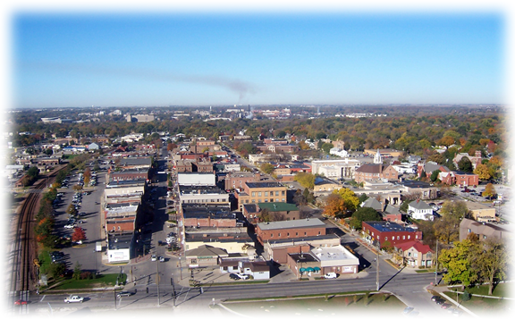

[City of Ames](https://www.cityofames.org/about-ames)

# Table of Contents
- [Table of Contents](#table-of-contents)
- [Problem Statement](#problem-statement)
- [Executive Summary](#executive-summary)
- [Introduction](#introduction)
- [Datasets Overview](#datasets-overview)
- [Model Building Workflow](#model-building-workflow)
  - [1. Data Dictionary](#1-data-dictionary)
  - [2. Data Cleaning](#2-data-cleaning)
  - [3. Data Visualization](#3-data-visualization)
  - [4. Feature Selection and Engineering](#4-feature-selection-and-engineering)
  - [5. Model Evaluation](#5-model-evaluation)
- [Conclusions](#conclusions)
- [Appendix](#appendix)


# Problem Statement

<hr 
 style="
 border:none;
 height:4px;
 background-color:DarkGray;
 ">


To create a machine learning model to predict the price of a property at sale using the housing dataset for the city of Ames, Iowa. In doing so, your main objective would be to minimize the difference between the predicted and the actual house price. The error metric of interest is root-mean-squared-error(RMSE). The modeling exercise is limited to using the Linear Regression family of models such as :

- Linear Regression
- Lasso
- Ridge
- Elastic Net

# Executive Summary
Three linear regression models are built to predict the house's sale price using a housing dataset for the city of Ames, Iowa. This dataset has listing information of houses sold between the years 2006 and 2010. The model building process involved cleaning the data to handle missing values, generating a suite of data visualizations to aid exploratory analysis, feature selection and engineering, data standardization, and model evaluation. This model can be used to provide an estimate of the sale price for the house, given the listing information
<hr 
 style="
 border:none;
 height:4px;
 background-color:DarkGray;
 ">

# Introduction

<hr 
 style="
 border:none;
 height:4px;
 background-color:DarkGray;
 ">

Whether you are looking to invest in, sell, or buy a real estate property, one of the critical considerations in the decision-making process is determining the "right price" of the property. An accurate estimate of the property's selling price is essential to get better value for your money. Apart from the usual considerations such as the square footage, neighborhood, the number of bedrooms, bathrooms, there are numerous other features of the house such as the quality of the basement finish, type of porch, roof material, etc., which influence the perception of the "right price" of the property. This project deals with predicting the sale price of a property in the city of Ames, Iowa using machine learning models. [Ames](https://en.wikipedia.org/wiki/Ames,_Iowa) is a city in Story County, Iowa, United States, located approximately 30 miles north of Des Moines in central Iowa. The datasets consist of over 80 different features of listed property and its corresponding sale price.


# Datasets Overview

<hr 
 style="
 border:none;
 height:4px;
 background-color:DarkGray;
 ">

There are two datasets,`train.csv` and `test.csv`, provided each containing the same number of feature columns. The model is trained and fit using the `train.csv` dataset. It has listing information on 2051 properties. `test.csv` dataset does not contain the sale price information and is used to generate predictions on the "unseen" data. It has listing information on 878 properties. The resulting prediction on this `test.csv` dataset is uploaded to [Kaggle](https://www.kaggle.com/) to score the model. 

# Model Building Workflow

<hr 
 style="
 border:none;
 height:4px;
 background-color:DarkGray;
 ">

## 1. Data Dictionary

<hr 
 style="
 border:none;
 height:2px;
 background-color:lightkGray;
 ">

[Dean De Cock](http://jse.amstat.org/v19n3/decock/DataDocumentation.txt) has provided a detailed description of all the features in the `train.csv` associated with a particular listing. These features can be categorized by their datatypes as Nominal, Ordinal, Discrete and Continuous variables. These datatypes form the primary basis for understanding the different data categories in the datasets and how to interpret a particular feature during the feature engineering phase of the model workflow. 
## 2. Data Cleaning 
<hr
 style="
 border:none;
 height:2px;
 background-color:lightkGray;
 ">
There are almost 10,000 missing values in the `train.csv` dataset of 160,000 values. There are null values in every row of the `train.csv` dataset. The top 5 features with the most missing value counts are:

| Feature | Count of <br>Null Values |
|----------------|--------------------------|
| Pool QC | 2042 |
| Misc Feature | 1986 |
| Alley | 1911 |
| Fence | 1651 |
| Fireplace Qu | 1000 |

There are 27 features in the dataset with at least one missing value. An essential step in the modeling workflow was to impute these missing values. The process involved generating visualizations to look at the distribution of the values, inspecting the related category feature columns to derive the possible values, and other data wrangling techniques to impute the missing values. E.g., 7 features that are related to the garage. Out of the 7, 6 of them have 114 rows of missing values. These 114 properties have the `Garage Area` information, which is zero for all. So the missing garage features were an indication of the absence of a garage on that property. The rest of the garage-related feature values were imputed using this association. The `train.csv` and `test.csv` were cleaned (no missing values) at the end of this step, forming an input to the next step. 
## 3. Data Visualization
The relationship between the predictors and response variables is investigated with a comprehensive suite of data visualizations. Their purpose and descriptions is provided below. 

- **Original vs Clean Datasets**
  - *Understanding the distribution of continuous variables and distribution of unique categories in each feature for object type variables for the before and after cleaning the `train.csv` dataset*
    - *Original Dataset*
      - [Distribution of Numeric Columns in Original Dataset](./imgs/Distribution_of_Numeric_Columns_in_Original_Dataset.png)
      - [Unique Value Counts of Object Type Columns with Original Dataset](./imgs/Unique_Value_Counts_of_Object_Type_Columns_with_Original_Dataset.png)
    - *Clean Dataset*
      - [Distribution of Numeric Columns in Cleaned Dataset](./imgs/Distribution_of_Numeric_Columns_in_Cleaned_Dataset.png)
      - [Unique Value Counts of Object Type Columns with Cleaned Dataset](./imgs/Unique_Value_Counts_of_Object_Type_Columns_with_Cleaned_Dataset.png)
    - *Train vs Test datasets*
      - *These visualizations were used to investigate whether the distribution of variables between train and test were consistent, identify any outliers between the datasets which may not get adequately modeled with the training dataset*
      - [Comparing Distribution of Numeric Columns Between Train and Test Dataset](./imgs/Comparing_Distribution_of_Numeric_Columns_Between_Train_and_Test_Dataset.png)
- **Investigating the Correlation Matrix, Distribution and relationship nature between Continuous Variables**
  - *These visualizations were used to check of linearity of the relationship between predictor and response variable, distribution of variables, multicollinearity between predictors*
    - [Set 1](./imgs/Pairplot_Scatter_HeatMap_Set1.png), [Set 2](./imgs/Pairplot_Scatter_HeatMap_Set2.png), [Set 3](./imgs/Pairplot_Scatter_HeatMap_Set3.png), [Set 4](./imgs/Pairplot_Scatter_HeatMap_Set4.png), [Set 5](./imgs/Pairplot_Scatter_HeatMap_Set5.png)
    - [Correlation Matrix SalePrice Continuous Categories](./imgs/Correlation_Matrix_SalePrice_Continuous_Categories.png)

- **Investigating the trends between Nominal variables and Sale Price**
  - *Each nominal variable has multiple categories associated with it. These visualizations were used to how strongly correlated all categories for a particular feature to the sale price. Box plots helped to identify the spread of the variable as well as spot any outliers. Pointplot of median home price help establish the trend that may be present for the categories*
    -  [Box Plot of SalePrices for Different Nominal Categories](./imgs/BoxPlot_of_SalePrices_for_Different_Nominal_Categories.png)
    -  [PointPlot of SalePrices for Different Nominal Categories](./imgs/PointPlot_of_SalePrices_for_Different_Nominal_Categories.png)

- **Investigating the trends between Ordinal variables and Sale Price**
  - *Along the same lines as nominal variables, a similar analysis was carried out for ordinal variables*
    - [Box Plot of SalePrices for Different Ordinal Categories](./imgs/BoxPlot_of_SalePrices_for_Different_Ordinal_Categories.png)
    - [PointPlot of SalePrices for Different Ordinal Categories](./imgs/PointPlot_of_SalePrices_for_Different_Ordinal_Categories.png)

- **Investigating the trends between Time Series variables and Sale Price**
  - *These plots show the sale price is correlated to the different time category variables present in the datasets*
    -  [PointPlot of SalePrices for Different Discrete TimeSeries Categories](./imgs/PointPlot_of_SalePrices_for_Different_Discrete_TimeSeries_Categories.png)

- **Investigating the trends between Discrete variables and Sale Price**
  - *These plots pertain to the discrete categories of variables such as number of rooms, number of fireplaces, number of cars in the garage, etc. A violin plot was used as it helps to visualize both the distribution as well as the spread of the variables with sale price*
    -  [ViolinPlot of SalePrices for Different Discrete Categories](./imgs/ViolinPlot_of_SalePrices_for_Different_Discrete_Categories.png)
 
## 4. Feature Selection and Engineering

<hr 
 style="
 border:none;
 height:4px;
 background-color:DarkGray;
 ">

There were five main components in this stage:
1. Feature selection by investigating the relationship between variables using the data visualization generated above.
2. Feature engineering was used to replace and/or reduce the count of existing features. E.g. a new feature was created that defined the property's age when it was sold using the information about when the house was built and when it was sold. Feature engineering also involved creating dummies for the selected categorical variables.
3. Standardization for Ridge and Lasso
4. Identifying outliers influencing the model performance
5. Iterate through the above steps primarily to minimize the sale price prediction error and get a good variance-bias tradeoff.

The full list of features which went into the model is provided below. The model has about 140 features. There were few data points in the train dataset which were identified as outliers. Primarily, category labels of a particular feature which were not observed in the test dataset were not included in the training of the model and dropped. E.g. certain neighborhoods were not present in the test dataset. The lot area column had few extremely high values for a residential property. These were dropped too.

<details>
  <summary><b>Predictors Data Dictionary</b></summary>

| Predictors           | Feature Engineering<br>Category | Parent Features                                                                  | Category Label<br>in Original Dataset |
|----------------------|---------------------------------|----------------------------------------------------------------------------------|---------------------------------------|
| Pool QC_1            | Combined and Map Labels         | Pool QC                                                                          | Po & Fa                               |
| Pool QC_2            | Combined and Map Labels         | Pool QC                                                                          | TA & Gd                               |
| Pool QC_3            | Combined and Map Labels         | Pool QC                                                                          | Ex                                    |
| Garage Qual_1        | Combined and Map Labels         | Garage Qual                                                                      | Po, Fa, TA, Gd                        |
| Garage Qual_2        | Combined and Map Labels         | Garage Qual                                                                      | Ex                                    |
| Fireplace Qu_1       | Combined and Map Labels         | Fireplace Qu                                                                     | Po, Fa, TA, Gd, Ex                    |
| Bsmt Qual_1          | Combined and Map Labels         | Bsmt Qual                                                                        | Po, Fa, TA                            |
| Bsmt Qual_2          | Combined and Map Labels         | Bsmt Qual                                                                        | Gd                                    |
| Bsmt Qual_3          | Combined and Map Labels         | Bsmt Qual                                                                        | Ex                                    |
| Garage Finish_3      | Combined and Map Labels         | Garage Finish                                                                    | Fin, RFn, Unf                         |
| Bldg Type_Other      | Dummies                         | Bldg Type                                                                        | Other                                 |
| Central Air_Y        | Dummies                         | Central Air                                                                      | Y                                     |
| House Style_1Story   | Dummies                         | House Style                                                                      | 1Story                                |
| House Style_2Story   | Dummies                         | House Style                                                                      | 2Story                                |
| House Style_SFoyer   | Dummies                         | House Style                                                                      | SFoyer                                |
| House Style_SLvl     | Dummies                         | House Style                                                                      | SLvl                                  |
| House Style_Unf      | Dummies                         | House Style                                                                      | Unf                                   |
| Sale Type_Oth        | Dummies                         | Sale Type                                                                        | Oth                                   |
| Sale Type_WD         | Dummies                         | Sale Type                                                                        | WD                                    |
| Exterior 1st_BrkFace | Dummies                         | Exterior 1st                                                                     | BrkFace                               |
| Exterior 1st_CemntBd | Dummies                         | Exterior 1st                                                                     | CemntBd                               |
| Exterior 1st_HdBoard | Dummies                         | Exterior 1st                                                                     | HdBoard                               |
| Exterior 1st_MetalSd | Dummies                         | Exterior 1st                                                                     | MetalSd                               |
| Exterior 1st_Other   | Dummies                         | Exterior 1st                                                                     | Other                                 |
| Exterior 1st_Plywood | Dummies                         | Exterior 1st                                                                     | Plywood                               |
| Exterior 1st_Stucco  | Dummies                         | Exterior 1st                                                                     | Stucco                                |
| Exterior 1st_VinylSd | Dummies                         | Exterior 1st                                                                     | VinylSd                               |
| Exterior 1st_Wd Sdng | Dummies                         | Exterior 1st                                                                     | Wd Sdng                               |
| Exterior 1st_WdShing | Dummies                         | Exterior 1st                                                                     | WdShing                               |
| Neighborhood_BrDale  | Dummies                         | Neighborhood                                                                     | BrDale                                |
| Neighborhood_BrkSide | Dummies                         | Neighborhood                                                                     | BrkSide                               |
| Neighborhood_ClearCr | Dummies                         | Neighborhood                                                                     | ClearCr                               |
| Neighborhood_CollgCr | Dummies                         | Neighborhood                                                                     | CollgCr                               |
| Neighborhood_Crawfor | Dummies                         | Neighborhood                                                                     | Crawfor                               |
| Neighborhood_Edwards | Dummies                         | Neighborhood                                                                     | Edwards                               |
| Neighborhood_Gilbert | Dummies                         | Neighborhood                                                                     | Gilbert                               |
| Neighborhood_IDOTRR  | Dummies                         | Neighborhood                                                                     | IDOTRR                                |
| Neighborhood_MeadowV | Dummies                         | Neighborhood                                                                     | MeadowV                               |
| Neighborhood_Mitchel | Dummies                         | Neighborhood                                                                     | Mitchel                               |
| Neighborhood_NAmes   | Dummies                         | Neighborhood                                                                     | NAmes                                 |
| Neighborhood_NPkVill | Dummies                         | Neighborhood                                                                     | NPkVill                               |
| Neighborhood_NWAmes  | Dummies                         | Neighborhood                                                                     | NWAmes                                |
| Neighborhood_NoRidge | Dummies                         | Neighborhood                                                                     | NoRidge                               |
| Neighborhood_NridgHt | Dummies                         | Neighborhood                                                                     | NridgHt                               |
| Neighborhood_OldTown | Dummies                         | Neighborhood                                                                     | OldTown                               |
| Neighborhood_SWISU   | Dummies                         | Neighborhood                                                                     | SWISU                                 |
| Neighborhood_Sawyer  | Dummies                         | Neighborhood                                                                     | Sawyer                                |
| Neighborhood_SawyerW | Dummies                         | Neighborhood                                                                     | SawyerW                               |
| Neighborhood_Somerst | Dummies                         | Neighborhood                                                                     | Somerst                               |
| Neighborhood_StoneBr | Dummies                         | Neighborhood                                                                     | StoneBr                               |
| Neighborhood_Timber  | Dummies                         | Neighborhood                                                                     | Timber                                |
| Neighborhood_Veenker | Dummies                         | Neighborhood                                                                     | Veenker                               |
| MS SubClass_150      | Dummies                         | MS SubClass                                                                      | 150                                   |
| MS SubClass_160      | Dummies                         | MS SubClass                                                                      | 160                                   |
| MS SubClass_180      | Dummies                         | MS SubClass                                                                      | 180                                   |
| MS SubClass_190      | Dummies                         | MS SubClass                                                                      | 190                                   |
| MS SubClass_20       | Dummies                         | MS SubClass                                                                      | 20                                    |
| MS SubClass_30       | Dummies                         | MS SubClass                                                                      | 30                                    |
| MS SubClass_40       | Dummies                         | MS SubClass                                                                      | 40                                    |
| MS SubClass_45       | Dummies                         | MS SubClass                                                                      | 45                                    |
| MS SubClass_50       | Dummies                         | MS SubClass                                                                      | 50                                    |
| MS SubClass_60       | Dummies                         | MS SubClass                                                                      | 60                                    |
| MS SubClass_70       | Dummies                         | MS SubClass                                                                      | 70                                    |
| MS SubClass_75       | Dummies                         | MS SubClass                                                                      | 75                                    |
| MS SubClass_80       | Dummies                         | MS SubClass                                                                      | 80                                    |
| MS SubClass_85       | Dummies                         | MS SubClass                                                                      | 85                                    |
| MS SubClass_90       | Dummies                         | MS SubClass                                                                      | 90                                    |
| Foundation_CBlock    | Dummies                         | Foundation                                                                       | CBlock                                |
| Foundation_Other     | Dummies                         | Foundation                                                                       | Other                                 |
| Foundation_PConc     | Dummies                         | Foundation                                                                       | PConc                                 |
| Garage Type_Attchd   | Dummies                         | Garage Type                                                                      | Attchd                                |
| Garage Type_Basment  | Dummies                         | Garage Type                                                                      | Basment                               |
| Garage Type_BuiltIn  | Dummies                         | Garage Type                                                                      | BuiltIn                               |
| Garage Type_CarPort  | Dummies                         | Garage Type                                                                      | CarPort                               |
| Garage Type_Detchd   | Dummies                         | Garage Type                                                                      | Detchd                                |
| Garage Type_NA       | Dummies                         | Garage Type                                                                      | NA                                    |
| Condition 1_Pos      | Dummies                         | Condition 1                                                                      | Pos                                   |
| Condition 1_RR       | Dummies                         | Condition 1                                                                      | RR                                    |
| Condition 1_RRN      | Dummies                         | Condition 1                                                                      | RRN                                   |
| MS Zoning_C (all)    | Dummies                         | MS Zoning                                                                        | C (all)                               |
| MS Zoning_FV         | Dummies                         | MS Zoning                                                                        | FV                                    |
| MS Zoning_I (all)    | Dummies                         | MS Zoning                                                                        | I (all)                               |
| MS Zoning_RH         | Dummies                         | MS Zoning                                                                        | RH                                    |
| MS Zoning_RL         | Dummies                         | MS Zoning                                                                        | RL                                    |
| MS Zoning_RM         | Dummies                         | MS Zoning                                                                        | RM                                    |
| Half Bath_1          | Dummies                         | Half Bath                                                                        | 1                                     |
| Half Bath_2          | Dummies                         | Half Bath                                                                        | 2                                     |
| Full Bath_1          | Dummies                         | Full Bath                                                                        | 1                                     |
| Full Bath_2          | Dummies                         | Full Bath                                                                        | 2                                     |
| Full Bath_3          | Dummies                         | Full Bath                                                                        | 3                                     |
| Bsmt Half Bath_1     | Dummies                         | Bsmt Half Bath                                                                   | 1                                     |
| Bsmt Half Bath_2     | Dummies                         | Bsmt Half Bath                                                                   | 2                                     |
| Bsmt Full Bath_1     | Dummies                         | Bsmt Full Bath                                                                   | 1                                     |
| Bsmt Full Bath_2     | Dummies                         | Bsmt Full Bath                                                                   | 2                                     |
| Bedroom AbvGr_1      | Dummies                         | Bedroom AbvGr                                                                    | 1                                     |
| Bedroom AbvGr_2      | Dummies                         | Bedroom AbvGr                                                                    | 2                                     |
| Bedroom AbvGr_3      | Dummies                         | Bedroom AbvGr                                                                    | 3                                     |
| Bedroom AbvGr_4      | Dummies                         | Bedroom AbvGr                                                                    | 4                                     |
| Bedroom AbvGr_5      | Dummies                         | Bedroom AbvGr                                                                    | 5                                     |
| Bedroom AbvGr_6      | Dummies                         | Bedroom AbvGr                                                                    | 6                                     |
| Kitchen AbvGr_1      | Dummies                         | Kitchen AbvGr                                                                    | 1                                     |
| Kitchen AbvGr_2      | Dummies                         | Kitchen AbvGr                                                                    | 2                                     |
| Kitchen AbvGr_3      | Dummies                         | Kitchen AbvGr                                                                    | 3                                     |
| Garage Cars_1        | Dummies                         | Garage Cars                                                                      | 1                                     |
| Garage Cars_2        | Dummies                         | Garage Cars                                                                      | 2                                     |
| Garage Cars_3        | Dummies                         | Garage Cars                                                                      | 3                                     |
| Garage Cars_4        | Dummies                         | Garage Cars                                                                      | 4                                     |
| BsmtFin Type 1_1     | Dummies                         | BsmtFin Type 1                                                                   | 1                                     |
| BsmtFin Type 1_2     | Dummies                         | BsmtFin Type 1                                                                   | 2                                     |
| BsmtFin Type 1_3     | Dummies                         | BsmtFin Type 1                                                                   | 3                                     |
| BsmtFin Type 1_4     | Dummies                         | BsmtFin Type 1                                                                   | 4                                     |
| BsmtFin Type 1_5     | Dummies                         | BsmtFin Type 1                                                                   | 5                                     |
| BsmtFin Type 1_6     | Dummies                         | BsmtFin Type 1                                                                   | 6                                     |
| Bsmt Exposure_1      | Dummies                         | Bsmt Exposure                                                                    | No                                    |
| Bsmt Exposure_2      | Dummies                         | Bsmt Exposure                                                                    | Mn                                    |
| Bsmt Exposure_3      | Dummies                         | Bsmt Exposure                                                                    | Av                                    |
| Bsmt Exposure_4      | Dummies                         | Bsmt Exposure                                                                    | Gd                                    |
| Overall Qual_2       | Dummies                         | Overall Qual                                                                     | 2                                     |
| Overall Qual_3       | Dummies                         | Overall Qual                                                                     | 3                                     |
| Overall Qual_4       | Dummies                         | Overall Qual                                                                     | 4                                     |
| Overall Qual_5       | Dummies                         | Overall Qual                                                                     | 5                                     |
| Overall Qual_6       | Dummies                         | Overall Qual                                                                     | 6                                     |
| Overall Qual_7       | Dummies                         | Overall Qual                                                                     | 7                                     |
| Overall Qual_8       | Dummies                         | Overall Qual                                                                     | 8                                     |
| Overall Qual_9       | Dummies                         | Overall Qual                                                                     | 9                                     |
| Overall Qual_10      | Dummies                         | Overall Qual                                                                     | 10                                    |
| Kitchen Qual_3       | Dummies                         | Kitchen Qual                                                                     | 3                                     |
| Kitchen Qual_4       | Dummies                         | Kitchen Qual                                                                     | 4                                     |
| Kitchen Qual_5       | Dummies                         | Kitchen Qual                                                                     | 5                                     |
| Heating QC_2         | Dummies                         | Heating QC                                                                       | 2                                     |
| Heating QC_3         | Dummies                         | Heating QC                                                                       | 3                                     |
| Paved Drive_2        | Dummies                         | Paved Drive                                                                      | P                                     |
| Paved Drive_3        | Dummies                         | Paved Drive                                                                      | Y                                     |
| Exter Qual_2         | Map Labels                      | Exter Qual                                                                       | TA                                    |
| Exter Qual_3         | Map Labels                      | Exter Qual                                                                       | Gd                                    |
| Exter Qual_4         | Map Labels                      | Exter Qual                                                                       | Ex                                    |
| age_when_sold        | New                             | Difference of Year Built and Yr Sold                                             |                                       |
| age_when_remodeled   | New                             | Difference of Year Remod/Add and Yr Sold                                         |                                       |
| Porch Total SF       | New                             | Sum of Wood Deck SF,Open Porch SF,<br>Enclosed Porch,3Ssn Porch,<br>Screen Porch |                                       |
| house_with_pool_1    | New                             | Binarized Pool Area                                                              |                                       |
| Total Bsmt SF        | Original                        |                                                                                  |                                       |
| Gr Liv Area          | Original                        |                                                                                  |                                       |

</details>


## 5. Model Evaluation

<hr 
 style="
 border:none;
 height:4px;
 background-color:DarkGray;
 ">

Four linear regression models were developed to be used in predicting the sale price of a property. Three of these models were regularized models-Ridge, Lasso and ElasticNet. The models were first cross-validated by splitting the train dataset into a train-test split. After achieving a satisfactory bias-variance trade-off with the best possible RMSE scores, predictions were generated for the test dataset. The final RMSE scores with the three models are provided in the table below

|    Model   | Cross-Validated<br>Mean | R2 score<br>(train,test) |  RMSE  |
|:----------:|:-----------------------:|:----------------------------:|:------:|
|   Linear   |           1.12          |         (0.929,0.918)        | 17,966 |
|    Ridge   |           1.12          |         (0.929,0.916)        | 18,043 |
|    Lasso   |           1.12          |         (0.928,0.916)        | 18,080 |
| ElasticNet |           1.12          |         (0.929,0.916)        | 18,081 |

Models were further evaluated to test for LINEM assumptions. Residuals were investigated for normality and homoscedasticity of errors and independence of observations. Residuals plot for [Linear model](./imgs/Validating_LINEM_Assumptions_LR_Model.png), [Ridge model](./imgs/Validating_LINEM_Assumptions_Ridge_Model.png), [Lasso model](./imgs/Validating_LINEM_Assumptions_Lasso_Model.png) and [ElasticNet](./imgs/Validating_LINEM_Assumptions_Enet_Model.png) show that the model does not violate the LINE assumptions. Additonally, the cross-plot of predicted sale price vs actual sale price show that the predictions are in a tight band around the 45-deg line for all the four [Linear](./imgs/Predicted_vs_Actual_SalePrice_LR_Model.png), [Ridge](./imgs/Predicted_vs_Actual_SalePrice_Ridge_Model.png), [Lasso](./imgs/Predicted_vs_Actual_SalePrice_Lasso_Model.png) models, and [ElasticNet](./imgs/Predicted_vs_Actual_SalePrice_Enet_Model.png)

# Conclusions

<hr 
 style="
 border:none;
 height:4px;
 background-color:DarkGray;
 ">

- Ames housing dataset is used to train and fit a linear regression model to estimate sale price of a house
- The RMSE score for this model is 18,000
- The model is validated for the linear model assumptions 
- Overall quality is the biggest positive contributor to the sale price and not having a garage is the biggest negative contributor


# Appendix

<hr 
 style="
 border:none;
 height:4px;
 background-color:DarkGray;
 ">

<details>
  <summary><b>Directory Tree Structure</b></summary>

```
├── code
│   ├── 01_Data_Investigation_Cleaning.ipynb
│   ├── 02_EDA_Data_Visualization.ipynb
│   ├── 03_Feature_Selection_Engineering_LinearRegression.ipynb
│   ├── 04_Regularization_Ridge.ipynb
│   ├── 05_Regularization_Lasso.ipynb
│   └── 06_Regularization_ElasticNet.ipynb
├── datasets
│   ├── submission_enet.csv
│   ├── submission_lasso.csv
│   ├── submission_lr.csv
│   ├── submission_ridge.csv
│   ├── test.csv
│   ├── test_clean_v1.csv
│   ├── train.csv
│   └── train_clean_v1.csv
├── imgs
│   ├── BoxPlot_of_SalePrices_for_Different_Nominal_Categories.png
│   ├── BoxPlot_of_SalePrices_for_Different_Ordinal_Categories.png
│   ├── CityofAmes.png
│   ├── Comparing_Distribution_of_Numeric_Columns_Between_Train_and_Test_Dataset.png
│   ├── Correlation_Matrix_SalePrice_Continuous_Categories.png
│   ├── Distribution_of_Numeric_Columns_in_Cleaned_Dataset.png
│   ├── Distribution_of_Numeric_Columns_in_Original_Dataset.png
│   ├── Lasso_Model_Regression_Coefficients.png
│   ├── Pairplot_Scatter_HeatMap_Set1.png
│   ├── Pairplot_Scatter_HeatMap_Set2.png
│   ├── Pairplot_Scatter_HeatMap_Set3.png
│   ├── Pairplot_Scatter_HeatMap_Set4.png
│   ├── Pairplot_Scatter_HeatMap_Set5.png
│   ├── PointPlot_of_SalePrices_for_Different_Discrete_TimeSeries_Categories.png
│   ├── PointPlot_of_SalePrices_for_Different_Nominal_Categories.png
│   ├── PointPlot_of_SalePrices_for_Different_Ordinal_Categories.png
│   ├── Predicted_vs_Actual_SalePrice_Enet_Model.png
│   ├── Predicted_vs_Actual_SalePrice_LR_Model.png
│   ├── Predicted_vs_Actual_SalePrice_Lasso_Model.png
│   ├── Predicted_vs_Actual_SalePrice_Ridge_Model.png
│   ├── Ridge_Model_Regression_Coefficients.png
│   ├── Unique_Value_Counts_of_Object_Type_Columns_with_Cleaned_Dataset.png
│   ├── Unique_Value_Counts_of_Object_Type_Columns_with_Original_Dataset.png
│   ├── Validating_LINEM_Assumptions_Enet_Model.png
│   ├── Validating_LINEM_Assumptions_LR_Model.png
│   ├── Validating_LINEM_Assumptions_Lasso_Model.png
│   ├── Validating_LINEM_Assumptions_Ridge_Model.png
│   └── ViolinPlot_of_SalePrices_for_Different_Discrete_Categories.png
└── Ames_Housing_Dataset_LinearRegression_Modeling.pdf
```
</details>


